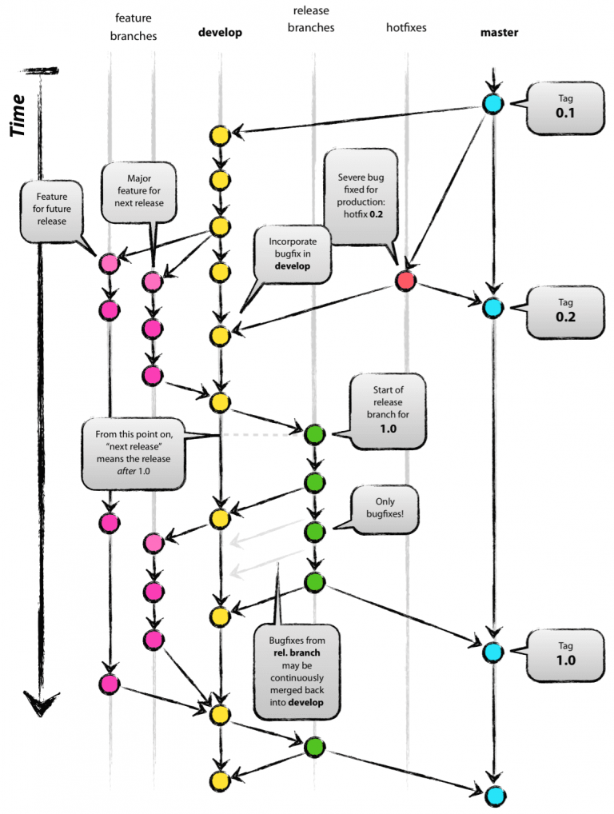

# Task 1. Git

## Описание  

В рамках данного задания необходимо повторить последовательность действий, указанных в схеме ниже.
Данная схема описывает Git flow методологию.  
Для выполнения данного задания будут созданные файлы в папке files.  

